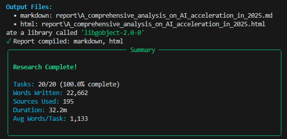

# 24 Hour Deep Research Agent

An experimental autonomous research system that conducts comprehensive, multi-hour research sessions and produces book-length reports with full citations on any topic.

<div align="center">
  
  <p><sub>Tasks are added dynamically during inference. The 47 tasks shown here reached 100 tasks just 25% through the research.</sub></p>
  <br>
  <h3>Sample Mini Research Output Limited to 20 Tasks</h3>
  <a href="A_comprehensive_analysis_on_AI_acceleration_in_2025.html">
    
  </a>
  <a href="A_comprehensive_analysis_on_AI_acceleration_in_2025.md">
    
  </a>
  <p><sub>Generated Dec 07, 2025 • 22,662 words • 195 sources • 20 sections (intentionally limited) • 32.2 minutes runtime</sub></p>
</div>


## Features

- **Comprehensive Research**: Automatically breaks down complex topics into 10-200+ focused research tasks
- **Long-Running Sessions**: Designed for multi-hour research with full state persistence
- **Multi-Source Search**: Integrates with Tavily (with full content extraction), Serper, and Brave search APIs
- **Citation Management**: Automatically tracks and cites all sources inline
- **Smart Task Prioritization**: Introduction first, body content next, conclusion last
- **Quality Control**: Validates sources and scores content quality
- **Multiple Export Formats**: Markdown, HTML (professional white/black theme), and PDF
- **Resume Capability**: Continue interrupted sessions exactly where you left off
- **Rate Limiting**: Built-in rate limiting to respect API limits
- **Rich CLI**: Terminal output with progress tracking and statistics

<div align="center">
  
  <p><sub>Mini version intentionally limited to 20 tasks for demonstration (Refer to the <a href="A_comprehensive_analysis_on_AI_acceleration_in_2025.html">output</a>) </sub></p>
</div>

## Architecture

```
+------------------+     +-------------------+     +-----------------+
|  Planner Agent   |---->| Researcher Agent  |---->|  Editor Agent   |
|  (Creates Plan)  |     |   (Deep Dives)    |     |   (Compiles)    |
+------------------+     +-------------------+     +-----------------+
         |                        |                        |
         v                        v                        v
+---------------------------------------------------------------------+
|                      State Database (SQLite)                         |
|              Tasks | Sources | Glossary | Sessions                   |
+---------------------------------------------------------------------+
         |                        |                        |
         v                        v                        v
+------------------+     +-------------------+     +-----------------+
|    LLM Client    |     |    Web Search     |     |  Content Extract|
| (Claude/GPT/OR)  |     | (Tavily/Serper)   |     |(Tavily + fallback BS4)|
+------------------+     +-------------------+     +-----------------+
```

## Quick Start

### 1. Installation

```bash
# Clone or download the project
cd deep-research-agent

# Create virtual environment
python -m venv venv
source venv/bin/activate  # On Windows: venv\Scripts\activate

# Install dependencies
pip install -r requirements.txt
```

### 2. Configuration

```bash
# Copy environment template
cp .env.example .env

# Edit .env with your API keys
```

**Required API Keys:**
| Provider | Purpose | Get Key |
|----------|---------|---------|
| Anthropic | LLM (recommended, very expensive) | [console.anthropic.com](https://console.anthropic.com/) |
| OpenRouter | LLM (Best alternative, free models available) | [openrouter.ai](https://openrouter.ai/keys) |
| OpenAI | LLM (alternative) | [platform.openai.com](https://platform.openai.com/api-keys) |
| Tavily | Search + Content (recommended) | [tavily.com](https://tavily.com/) |
| Serper | Search (alternative) | [serper.dev](https://serper.dev/) |
| Brave | Search (alternative) | [brave.com/search/api](https://brave.com/search/api/) |

You need one LLM provider and one search provider.

### 3. Run Research

```bash
# Start research with a query
python main.py research "A comprehensive analysis of quantum computing hardware"

# Resume an interrupted session
python main.py research --resume
```

## CLI Commands

```bash
# Start new research
python main.py research "Your research query"

# Resume existing session
python main.py research --resume

# Check session status
python main.py status

# Export to different formats
python main.py export --format html
python main.py export --format markdown
python main.py export --format all

# Reset database (clear all progress)
python main.py reset

# Validate configuration
python main.py validate
```

## Configuration

Edit `config.yaml` to customize behavior:

```yaml
# LLM Settings
llm:
  provider: "anthropic"  # anthropic, openai, openrouter
  models:
    planner: "claude-sonnet-4-20250514"
    researcher: "claude-sonnet-4-20250514"
    writer: "claude-sonnet-4-20250514"

# Search Settings
search:
  provider: "tavily"  # tavily, serper, brave
  max_results: 8
  queries_per_task: 3

# Research Parameters
research:
  min_initial_tasks: 10
  max_total_tasks: 200
  max_recursion_depth: 1    # Keep low to prevent task explosion
  min_words_per_section: 500
  max_runtime_hours: 24

# Output Settings
output:
  formats: ["markdown", "html"]
  include_toc: true
  include_bibliography: true
```

## Project Structure

```
deep-research-agent/
├── main.py                  # Entry point
├── cli.py                   # CLI interface (Typer)
├── config.yaml              # Your configuration
├── config.example.yaml      # Configuration template
├── requirements.txt         # Python dependencies
├── .env                     # API keys (create from .env.example)
├── .env.example             # Environment template
├── src/
│   ├── __init__.py          # Package exports
│   ├── config.py            # Configuration and Pydantic models
│   ├── database.py          # SQLite state management
│   ├── llm_client.py        # Multi-provider LLM abstraction
│   ├── agents.py            # Planner, Researcher, Editor agents
│   ├── tools.py             # Search and content extraction
│   ├── compiler.py          # Report compilation (MD/HTML/PDF)
│   ├── orchestrator.py      # Main research loop
│   └── logger.py            # Rich console output
├── report/                  # Generated chapters and final reports
├── logs/                    # Log files
└── research.db              # SQLite database (created at runtime)
```

## How It Works

### Phase 1: Planning
The Planner Agent analyzes your query and creates a structured research plan with prioritized tasks:
- Priority 9-10: Introduction, background, definitions (researched first)
- Priority 5-8: Main body content, analysis, applications
- Priority 1-2: Conclusion, future directions (researched last)

### Phase 2: Research Loop
The Researcher Agent iteratively processes each task:
1. Generates targeted search queries
2. Searches via Tavily/Serper/Brave
3. Extracts full content from top results
4. Synthesizes findings into detailed markdown (500-3000 words)
5. Adds inline citations for all claims
6. Optionally discovers critical sub-topics for deeper research
7. Saves progress to database after each task

### Phase 3: Compilation
The Editor Agent and Compiler produce final outputs:
1. Generate executive summary
2. Create conclusion synthesizing all findings
3. Compile chapters into unified reports
4. Generate table of contents, bibliography, glossary
5. Export to Markdown, HTML, and PDF

## Resilience Features

- **State Persistence**: All progress saved to SQLite with WAL mode
- **Graceful Shutdown**: Ctrl+C saves progress and compiles partial report
- **Resume Capability**: `--resume` flag continues from last task
- **Error Recovery**: Failed tasks logged and skipped, research continues
- **Rate Limiting**: Configurable limits for LLM, search, and scrape calls
- **Retry Logic**: Automatic retries with exponential backoff

## Output

After a research session completes:

```
report/
├── 01_definition_of_ai_acceleration.md
├── 02_overview_of_ai_progress.md
├── 03_historical_background.md
├── ...
├── A_comprehensive_analysis_on_AI_acceleration_in_2025.md
└── A_comprehensive_analysis_on_AI_acceleration_in_2025.html
```

The HTML report uses a clean, professional white/black theme suitable for printing or professional distribution.

## Troubleshooting

**"API key not set"**
- Ensure `.env` file exists with required keys
- Check that provider in `config.yaml` matches your available API key

**"Rate limit exceeded"**
- Reduce `rate_limits` values in `config.yaml`
- Increase `research.session_delay` for longer pauses between tasks

**"No tasks found"**
- Run `python main.py status` to check database state
- Try `python main.py reset` to start fresh

**"PDF generation failed"**
- Install WeasyPrint: `pip install weasyprint`
- WeasyPrint requires system dependencies (GTK) on some platforms

## Extending

### Adding New LLM Providers
1. Create client class in `src/llm_client.py` inheriting from `BaseLLMClient`
2. Implement `complete()` and `complete_with_messages()` methods
3. Add provider to the factory function

### Adding New Search Providers
1. Add search function in `src/tools.py`
2. Add provider enum in `src/config.py`
3. Update `web_search()` to handle new provider

## License

MIT License - Use freely for personal and commercial projects.

---

Built for comprehensive research automation.